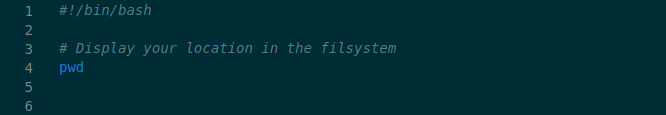
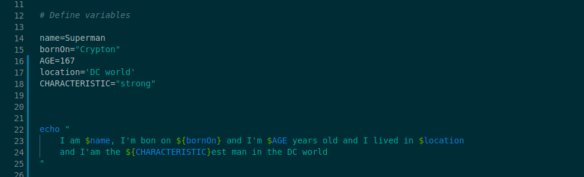
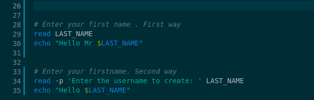
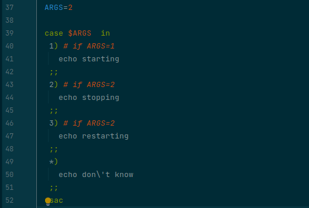

# Le Shell Scripting
Il est temps de s'amuser. Il est temps de commencer à automatiser des opérations plus ou moins complexes. 

## 1. Introduction

La programmation shell, est un "minilangage" de programmation intégré à Linux. Ce langage n'est pas aussi complet que le `Ruby` ou le `JS`, mais il permet : 
- gérer vos données (supprimer, filtrer, extraire, etc.), 
- surveiller votre machine (applications, process)
- lancer des tâches à des fréquences prédéfinit, 
- installer, mettre à jour des logiciels sur des serveurs distant, 
- etc.

L'avantage du langage shell est qu'il est déjà intégré à Linux. De ce fait, pas besoin d'installer des librairies/logiciels supplémentaires ou encore compiler avant de lancer votre code.

## 2. La ressource
### 2.1. Principes de base du script shell
Rien de mieux qu'un exercice guidé pour rentrer dans le bain.

Tout d'abord on crée un fichier `first_script.sh`, tu remarques que le fichier porte l'extension `.sh`.
La convention veut que l'on ajoute cette extension, main ce n'est pas une obligation. 
La preuve un fichier nommé `first_script` marchera très bien.

```
touch first_script.sh
```

### 2.1.1 Shebang
Ensuite on ajoute quelques lignes de code shell dans ce fichier.



La première ligne indique quel type de shell vous allez utiliser. 
Comme tu l'as appris hier, plusieurs types de shell existent et selon le type de shell, la syntaxe peut varier. 
Nous allons utiliser le shell le plus courant, à savoir, le `bash`.

Indiquer le type de shell, n'est pas obligatoire, 
mais ça te sauvera la mise plus d'une fois. Par exemple quand tu voudras exécuter du script shell sur des serveurs AWS, OVH, 
ou on-premise qui n'auront pas forcément ton shell préféré préinstaller :).

Point important : Si on ne spécifie pas le shell, celui de l'utilisateur est utilisé par défaut.

### 2.1.2 Comment le Shell script est interprété
Maintenant que l'on a ce magnifique bout de code comment on l'exécute ?

Je pourrais te le dire directement, mais il faut que tu comprennes d'abord comment le shell lis et lance un script.

Eh bien, c'est pas si compliqué :

1. Le shell lis la première ligne `#!/bin/bash` pour savoir quel type de shell utilisé.
2. Ensuite le Shell, que tu as spécifié au début, lit tout le fichier ligne par ligne. 
   Expliquer d'une manière plus concise le shell fait ceci `bin/bash <FILENAME>` (si bien sûr, c'est le bash que tu as choisi).

### 2.1.2 Rendre exécutable un script shell
Mais comment on exécute shell script bon sang de bonsoir ?

Un peu de patience, tout vient à point nommer pour celui qui sait attendre :).

Tout d'abord on doit rendre le script exécutable en donnant les droits d'exécution à l'utilisateur qui souhaite l'utiliser.

```sh
➜ ls -al 
-rw-rw-r--  1 gui gui   61 nov.  19 18:34 first_script.sh

# Give the right access
➜ chmod 750 first_script.sh

➜ ls -al 
-rwxr-x---  1 gui gui   61 nov.  19 18:34 first_script.sh
```

Pas besoin, de mille et une explications, hier tu as appris à décrypter et utiliser les permissions linux. 
Au cas où, cette [doc](https://www.linuxtricks.fr/wiki/droits-sous-linux-utilisateurs-groupes-permissions) peux te rafraîchir la mémoire.


Ensuite on lance notre script shell comme ceci `./first_script.sh`, tu remarques ici, que j'ai spécifié le `chemin relatif` du fichier. 
Le chemin relatif ou absolue, est nécessaire lorsque tu veux exécuter du shell script. 
Ce chemin indique à votre shell où se situe le fichier qui contient le code shell.

Tu peux, maintenant, exécuter n'importe quelle commande que tu as appris jusqu'ici dans ce script et à toi la gloire :


### 2.1.3 Les variables
Les variables sont assez simple à créer et à lire :



Le shell script est très permissif comme tu t'en rendras compte bientôt.
De ce fait, pour t'éviter des mal de crâne lunaires sur la syntax des variables, 
voici quelques informations qui vont te permettre d'aborder les variables sereinement :

1. Le nom d'une variable peut être en minuscule ou majuscule, mais la convention préconise l'utilisation de la majuscule.
2. La valeur d'une variable peut être un `string` un `nombre`, ou rien du tout (dans ce cas la valeur sera interprété en fonction de l'utilisation).
3. Le nom d'une variable ne doit pas comporter de caractères spéciaux de types `@WORLD`, `ADD-FILE` ou `_PROCESS` mais ceci `LAST_JOB` est possible :).
4. Cette syntaxe `${CHARACTERISTIC}` est obligatoire si tu veux ajouter un texte à la suite de la variable.


### 2.1.4 Lire les inputs
La commande `read`, permet de lire les `inputs` de ton clavier, example : 



Je t'invite à en apprendre plus sur cette commande à l'aide de tes commandes préférées `man, help, info`.


### 2.1.5 Les conditions - If statements
Cette [doc](https://acloudguru.com/blog/engineering/conditions-in-bash-scripting-if-statements) explique l'utilisation des conditions ainsi que la différence entre les deux types de syntaxe du `if`.

Ce [thread stackoverflow](https://stackoverflow.com/questions/669452/is-double-square-brackets-preferable-over-single-square-brackets-in-ba) te donne quelques précisions le choix entre les deux types d'utilisation des `brackets` dans le `if`.


#### Case - statements
Pour le `case statements`, tu dois t'en douter, rien de nouveau. Néanmoins, prends garde à la syntaxe :).




## 3. Points importants à retenir

Le shell script est très permissif, de ce fait, le choix de la syntaxe et sa typologie sont très important.

Pour un script shell bien écrit voici quelques règles à suivre :

- Dès la creation de ton fichier, rends le directement exécutable, pour éviter d'oublier.
- Au debut de ton fichier, précise toujours le langage Shell.
- Écrit toujours tes variables en majuscule.

## 4. Pour aller plus loin
Tout comme le `Ruby` ou le `JS` il est possible d'écrire ton `if` en une ligne ou également imbriquer plusieurs `if`. 
Je te laisse chercher par toi-même la syntaxe.