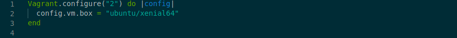
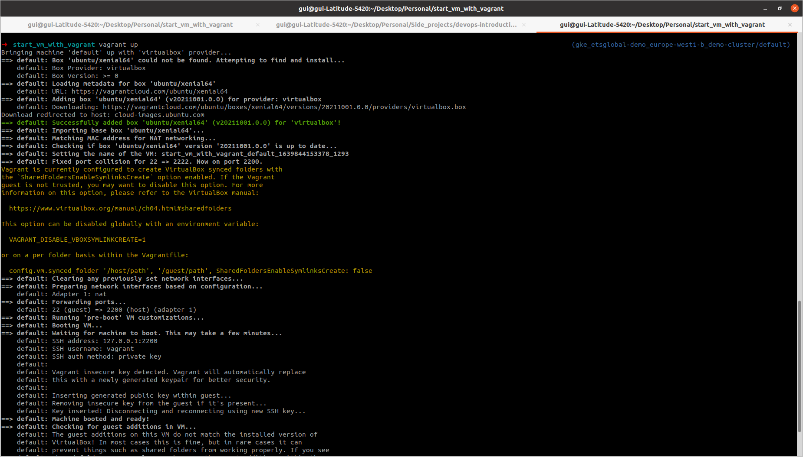
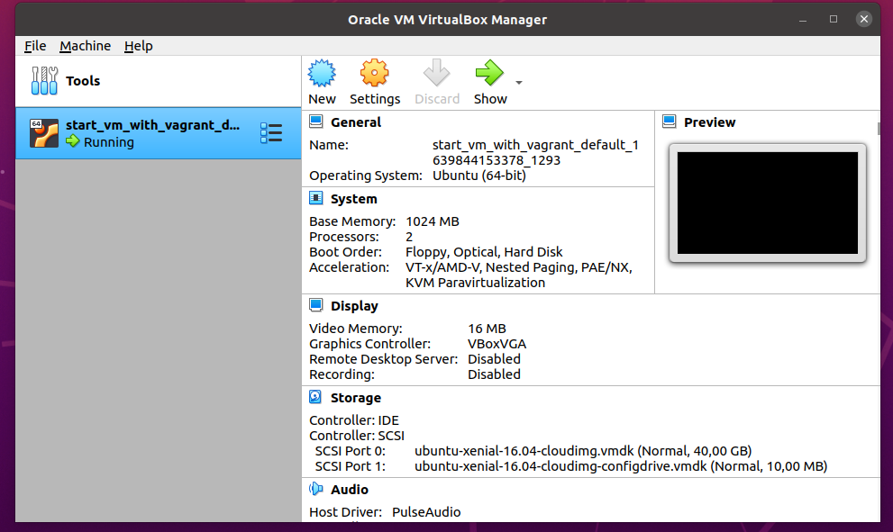

# La virtualization
Après deux jours sur l'environnement Linux et les commandes Shell, 
il est temps d'aborder la virtualization, qui est un aspect important dans la compréhension des `containers docker`.

## 1. Introduction
Tu te demandes pourquoi je te parle de virtualization au lieu d'aborder directement les `containers Docker`.
Eh bien parce que les ` containers` sont une forme de virtualisation. De ce fait comprendre la virtualisation t'aidera à mieux comprendre comment fonctionne les `containers`.

## 2. Historique et contexte

Dans les années 70, quand les ordinateurs ont commencé à se propager, seules les universités et grandes entreprises pouvaient y avoir accès.
En effet, a cette époque les petites entreprises et encore moins les particuliers ne pouvaient pas s'offrir le luxe d'avoir un ordinateur, à la place, 
ils les louaient à $1000/mois. 
Avec l'inflation de nos jours, c'est un peu près $8000/mois, je te laisse imaginer le prix d'un ordinateur dans ces temps-là :).
Tu comprends pourquoi peu de personne avait accès à un ordinateur.

Et c'est là qu'entre en scène les débrouillards de l'époque qui ont essayé d'optimiser au maximum l'utilisation des ordinateurs, 
en inventant plusieurs technologies de partage d'un même ordinateur par plusieurs utilisateurs et programmes, parmi eux :

- En 1970, la virtualisation par IBM (nous allons y revenir) et le système d'exploitation Unix.

- le `chroot (chroot = change root) environment` en 1979, qui dans le `filesystem` permet de changer le chemin du `root directory` d'un `process` et ses `child process`.
  En d'autres mots, avec `chroot` un process à un accès limité au filesystem du `chroot environment`.

  C'étais le début des environnements partagé par plusieurs utilisateurs.

- un peu plus tard, dans les années 1990, le fameux `Linux jail command` développé par Bill Cheswick et inspiré par le `chroot`.

  Bill Cheswick, a développé ce système, pour espionner et apprendre les techniques des [crackers](https://www.techtarget.com/searchsecurity/definition/cracker#:~:text=A%20computer%20cracker%20is%20an,because%20the%20challenge%20is%20there.).
  Un [célèbre article](https://www.cheswick.com/ches/papers/berferd.pdf) parmi la communauté Linux écrit par Bill Cheswick lui-même explique comment il a procédé.

PS. Le concept `process` et `child process`, n'est pas évident à appréhender, de ce fait, voici une [documentation](https://www.geeksforgeeks.org/difference-between-process-parent-process-and-child-process/) qui te servira d'antisèche :).

L'idée d'avoir un environnement partagé à continué à son chemin au fil des technologies inventées par les devs et les enterprises.
C'est en 2006 que les devs de Google ont annoncé travailler sur une technologie révolutionnaire appelée `process containers`. 

Cette technologie, limite les resources (CPU, RAM, etc.) utilisés par un `groupe de process`. 
C'est fut, une annonce incroyable pour cette époque, car avant le `process containers` on ne pouvait limiter l'accès que d'un seul `process`.

Par la suite Google renomma cette technologie en `Cgroups (control groups)` pour éviter la confusion avec le terme `container`.
Et enfin cette technologie fut intégrée au `Linux Kernel`, ce qui permis en 2007, la naissance du LXC (Linux Container), l'ancêtre des `containers` tel que tu vas les découvrir la semaine prochaine :).

La suite de l'histoire la semaine prochaine avec la découverte de Docker :).


## 3. La ressource
Maintenant que tu en sais plus sur les origines des `containers docker`, 
tu vas découvrir par la pratique la `virtualisation`, 
ce qui te permettra t'expérimenter et comprendre des concepts qui te seront d'un grand secours la semaine prochaine avec les `contaieners Docker`. 

Depuis son invention par IBM dans les années 1970, la virtualisation a beaucoup évolué. 
Cependant, son principe reste le même partager les ressources du hardware entre plusieurs utilisateurs/programmes, 
tout en faisant en sorte que chaque utilisateur/programme ait un environment isolé.

Bien avant de démarrer notre première VM, analysons d'abord comment la virtualisation marche concrètement,
disons que tu possèdes un PC qui un OS, peu importe l'OS.

Sur ce PC on installe un `hyperviseur de type 2`, c'est un logiciel basé sur `l'hyperviseur`.

Je vois que ton cerveau commence à cogiter fortement. :).
Mais ne t'inquiète pas, on va expliquer chaque mot.

L'hyperviseur, est un logiciel qui permet de créer et d'exécuter des machines virtuelles.

PS. Une machine virtuelle est un environment virtuel qui fonctionne comme un OS virtuel, avec ses propres ressources (RAM, CPU, network, ...).

Il est deux types d'hyperviseur :
- Hyperviseur de type 2, se lance sur un PC "normal", en tant qu'application, donc sur un PC où est déjà installé un OS.

  `Oracle VirtualBox`, `VMware workstation` sont par example des hyperviseurs de type 2.

- Hyperviseur de type 1, se lance directement sur le PC et **remplace l'OS, donc sur un PC/serveur "nu"**. 
  Ce type d'hyperviseur est très prisé dans les datacenters.

  `Microsoft Hyper-V`, `VMware vSphere` sont par exemple des hyperviseurs de type 1

C'est deux types d'hyperviseurs peuvent être représenté comme ceci : 

*TODO: schema hypervisor* ==> https://geek-university.com/oracle-virtualbox/what-is-hypervisor/

Maintenant que tu en sais plus, nous allons découvrir la virtualisation de type 2 avec VirtualBox.

### 3.1. Ta première VM
#### 3.1.1. Installer Virtualbox
Cette [doc](https://linuxhint.com/install-virtualbox-linux/) te montre comment installer VirtualBox sur Ubuntu

#### 3.1.2. Démarrer une VM.
Cette [video](https://www.youtube.com/watch?v=sB_5fqiysi4) te montre comment démarrer une VM sans anicroche.

Comme tu l'as vu dans la video, créer des VM n'est pas si compliqué, ce qui l'est par contre, c'est de configurer cette VM et interagir avec elle.

L'interaction et la configuration de VirtualBox et ses VMs sont hors de notre scope et nécessites d'en savoir davantage sur :

- le réseau (le modèle OSI, NAT, la différence entre les IP privée et publique définir un sous-réseau, ouvrir des ports sur la machine host et guest, etc.)
- les différents types de stockage qu'offre VirtualBox.

Explorer ces différents sujets, nécessite quelques jours et n'a pas de réelle valeur ajoutée pour à ce stade.

Je te vois venir, la question que tu te poses surement, c'est pourquoi en parler dans ce cas ?

Hé, bien la réponse est simple tu peux tirer avantages de VirtualBox sans pour autant connaitre chaque aspect technique de celui-ci à l'aide d'un outil appelé VirtualBox


### 3.2. Gagner en productivité avec Vagrant.

#### 3.2.1. Vagrant qu'est-ce que c'est ?

Vagrant est un outil pour construire et manager des VMs. Il encapsule l'hyperviseur présent sur la machine.
En d'autres mots, l'outil Vagrant se situe entre la VM et l'hyperviseur, ce qui veut dire que la création des VMs se fait à l'aide commande lancé avec Vagrant.
Voici un schéma qui va certainement t'aider.

*TODO: schéma recap*

Ainsi l'utilisateur de Vagrant va construire, lancer, stopper, détruire et réutiliser des VMs à l'aide de commande Vagrant ou un fichier appelé `Vagrantifle`.
Ce fichier peut être partagé/versionné, ce qui facilite la replication du même environment.

Les prouesses de Vagrant sont dû à 3 composants : 
- D'abord le fichier `Vagrantfile`, qui est un fichier Ruby :), permet de décrire l'environnement (le nombre de VMs, le CPU et la RAM de chaque VM, les commandes qui seront lancées au démarrage de chaque VM, etc.) que l'on souhaite à l'aide du code Ruby. <emoji>


- Ensuite un élément appelé `box` ou `golden image`, il définit l'OS qui va être utilisé pour lancer votre VM.
  Cet élément est important, car il permet de reproduire par example l'environnement de production en local. Par example une application qui va être déployé sur un serveur Debian 8 en production peut être facilement testé en local avec une `golden image` Debian 8.


- Et enfin les `plugins`, ils permettent d'ajouter des fonctionnalités supplémentaires telles que :
  - deployer directement sur AWS, heroku ou GCP.
  - installer directement des outils comme Docker, mongodb ou encore mysql, directement dans votre VM.

De ce fait Vagrant en permettant de contrôler le workflow complet des VMs et de faire travailler une team de devs sur exactement le même environnement de développement.


### 3.3. Lancer sa VM à l'aide de Vagrant

#### 3.3.1. Installer Vagrant
Bien la première chose est d'installer Vagrant. Cette [doc](https://www.vagrantup.com/docs/installation) de l'organisation Hashicorp, qui au passage a créé `Vagrant` est un bon point de départ.

1. Ajouter la clé APT sur ta machine. Les clés PAT permettent de garantir que le dépôt où se trouve le paquet (application/outil) que vous voulez installer est sûr.
```shell
curl -fsSL https://apt.releases.hashicorp.com/gpg | sudo apt-key add -
```

2. Télécharge le `repository` du paquet sur ta machine. Un `repository` de paquet APT est un serveur réseau ou un répertoire local dans lequel se trouve des paquets qui ont une extension `.deb`.
```shell
sudo apt-add-repository "deb [arch=amd64] https://apt.releases.hashicorp.com $(lsb_release -cs) main"
```

3. Maintenant que tu as ajouté ce `repository` tu peux télécharger et installer les paquets qui s'y trouvent sur ta machine.
```shell
sudo apt-get update && sudo apt-get install vagrant
```

4. Vérifier que vagrant est bien installer avec cette commande.
```shell
vagrant --version
```

Maintenant que Vagrant est installé, il est temps de lancer notre VM.
Pour ce tutoriel, nous allons lancer une VM de type Ubuntu 16.04 et nous connecter à cette VM.

La commande `vagrant init` permet d'instancier l'environment de travail et par la même occasion de créer le fameux `Vagrantfile`

Mais avant de lancer cette commande, il est conseillé de créer un dossier où les éléments créer par le Vagrant ini vont s'ajouter, 
ceci permet de mieux s'organiser et par la suite pour versionner ce dossier si besoin.

```shell
# Create a directory and move into it :).
mkdir start_vm_with_vagrant && cd $_
```

Dans ce fichier lances la commande `vagrant init` qui va générer le Vagrantfile.
```shell
vagrant init
```

#### 3.3.2. Utiliser le vagrantfile et lancer la VM.

Ce fichier, une fois les commentaires effacés, ressemble à celui-là


La première ligne spécifie la version de L'outil Vagrant, ici nous utilisons la version 2.

Ensuite, la deuxième ligne désigne la `box` (l'image de l'OS) que l'on souhaite utiliser.
La plupart des `box`, sont hébergés sur  [Vagrant Cloud ](https://app.vagrantup.com/boxes/search).
Nous allons utiliser l'OS d'Ubuntu 16. Chaque `box` qui se trouve sur Vagrant Cloud contient des explications sur la manière dont on les utilise.

Pour utiliser un `box` rien de plus simple. 


Enfin, lances la commande `vagrant up` dans le dossier où se trouve le Vagrantfile.


A la différence de Virtualbox où la création de la VM nécessite une image de l'OS, de créer un espace de stockage, mettre en place un réseau afin de pouvoir te connecter etc.
Avec Vagrant une seule commande suffit.

Tu peux maintenant te connecter à cette VM avec `vagrant ssh` et boom ! 
Te voici dans le terminal de ta VM, libre de l'utiliser comme bon te sembles. 
La vie est belle :).

Cette VM peut accéder à internet télécharger du contenu lancer des applications, etc.

Une fois que tu as finis de t'amuser avec tu peux :
- stopper la VM avec `vagrant suspend`, et relancer la VM avec `vagrant up`
- éteindre la VM avec `vagrant halt` et rallumer le VM avec `vagrant up`
- détruire complétement ta VM avec `vagrant destroy`

Mais pour l'instant laisse cette VM `up`, j'ai une dernière chose à te montrer.

#### 3.3.3. Accéder au VM créer par Vagrant depuis VirtualBox

Comme je te l'ai dit plus haut, Vagrant encapsule Virtualbox. C
e qui permet d'utiliser Virtualbox sans pour autant connaître tous ses éléments techniques.
**C'est ce que l'on appelle l'abstraction**. En d'autres mots, l'abstraction permet d'utiliser des outils/applications/fonctions/classes sans pour autant maîtriser/connaître leurs fonctionnements interne, 
c'est le cas par exemple des outils du Cloud (Heroku, Vercel, AWS), qui simplifient l'accès à des services, qui, pour la plupart sont extrêmement compliqués à créer par soi-même.

Dans notre cas si tu lances Virtualbox, tu vas t'apercevoir qu'une VM portant le nom du dossier dans lequel il réside existe.


Comme avec les commandes de Vagrant, tu peux suspendre, arrêter, relancer et détruire cette VM.

Vagrant permet d'aller encore plus loin dans la customisation des VMs, mais tu en as assez vu pour aujourd'hui, demain est un autre jour :).

## 5. Pour aller plus loin
Pas besoin pour le moment.