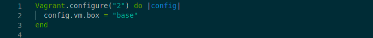
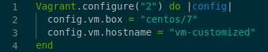
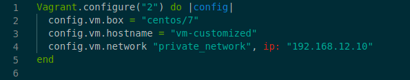
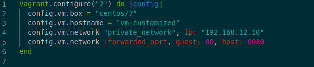
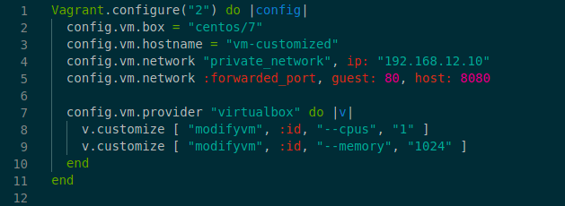
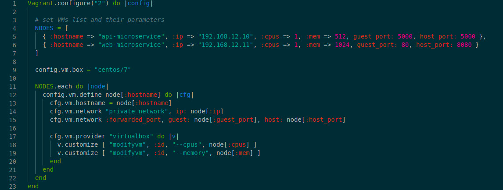

# Customiser les VM à l'aide Vagrant

## 1. Introduction
Hier, tu as découvert l'utilité de Vagrant et son fonctionnement, aujourd'hui on va aller plus loin dans l'utilisation de Vagrant.


## 2. Une VM aux petits oignons

Avec Virtualbox tu peux customiser un peu prêt tous les éléments de ta VM :
- le hostname
- l'IP privée
- les ports à ouvrir sur ta VM et sur le host
- les capacités en CPU, RAM et disk
- le type de réseau et sous-réseau
- et.

Et tout ce que tu peux faire avec Virtualbox, tu peux également le faire avec Vagrant. Dans ce cours nous explorer certaines possibilités de customisations qu'offres Vagrant à travers le Vagrantfile.

### 2.1.  Customiser ses VM
Nous allons commencer par créer un dossier et lancer la commande `vagrant init` depuis celui-ci.
Et comme on s'y attend un Vagrantfile va être généré.

Ce fichier ressemble à celui-ci moins les commentaires :




#### 2.1.1. Définir un hostname 
Pour définir un `hostname` spécifique, il suffit d'ajouter ce code, `config.vm.hostname = "VM_NAME"` à ton Vagrantfile, comme ceci :



Cette [doc](https://www.maketecheasier.com/hostname-in-linux/) t'expliques en quelques mots pourquoi un hostname peut s'avérer utile.

Pour tester, lances la commande `hostmane` dans la VM.


#### 2.1.2. Définir une IP
Dans certaines infrastructures connaitre les addresses IP des VM est très importants, par exemple une architecture micro-services avec une application par VM nécessite de connaitre les IP de chaque VM pour permettre les interactions entre elles.
Ainsi pour définir l'IP privée d'une VM, ajoutes ce code `config.vm.network "private_network", ip: "PRIVATE_IP"`, comme dans cette example :



Lances la commande `hostname -I | awk '{print $2}'` dans la VM pour tester.

PS. Si tu es un peu perdu aves les IP privées et publiques cette [doc](https://whatismyipaddress.com/private-ip) va t'en apprendre davantage.

#### 2.1.3. Ouverture des ports
Le port d'une VM peut être partagé sur un des ports du host, avec cette ligne `config.vm.network :forwarded_port, guest: VM_PORT, host: HOST_PORT`, dans cette example :



Ainsi, il devient possible d'accéder à la VM depuis votre host, 
ce qui peut être intéressant, par exemple,
lorsque l'on veut accéder à une application qui tourne dans la VM depuis le host.

Pour tester, on va installer un serveur `Apache` dans la VM avec ces commandes ci-dessous.
Pour informations la distribution `Centos` utilise un gestionnaire de paquets nommé `yum` à la différence de la distribution `Ubuntu` dont le gestionnaire de paquet est `apt`.

```shell
# Update yum packages
sudo yum -y update 

# Install apache server
sudo yum -y install httpd 

# Start apache server
sudo systemctl start httpd
```

Ensuite depuis le host, utilise ton navigateur préféré pour faire une requête sur ce `localhost:8080`.

#### 2.1.3.1. 🚀 ALERTE BONNE ASTUCE
Il l'arrive que tu souhaites tester rapidement la sortie d'un port en particulier sur ton host.
Pour cela tu n'es pas obligé de toujours utiliser ton navigateur, tu peux, à la place utiliser la commande `curl`, example :

```shell
curl localhost:8080
```

La commande `curl` est remplie de tellement d'options et de fonctionnalités, qu'elle n'a pas à rougir face à [Postman](https://www.postman.com/) ou [Insomnia](https://insomnia.rest/).
Un `man curl` t'en apprendras davantage.

#### 2.1.3. Limiter les capacités d'une VM.
Lorsque l'on commence à lancer plusieurs VM, il devient indispensable d'ajuster les capacités de la VM aux éléments qui vont tourner à l'intérieur ainsi qu'aux capacités du host.
Pour cela, il est nécessaire de passer par le provider `virtualbox`, comme dans cette example :



Pour tester, lances depuis la VM ces commandes :

```shell
# get CPU
grep -c processor /proc/cpuinfo

# get memory
echo "Memory: $(grep -c MemTotal /proc/meminfo)"
```

#### 2.1.4 Lancer plusieurs VM
Avec le Vagrantfile, lancer plusieurs VM customisées, devient un jeu d'enfant. Par exemple :



Comme tu peux le voir, ce n'est que du Ruby, tout est là, pas besoin d'explications. :).


#### 2.1.5. 🚀 ALERTE BONNE ASTUCE
Si tu fais des changements dans le Vagrantfile :
- tu dois d'arrêter et relancer ta VM via ces commandes :

```shell
# Stop Vagrant box
vagrant halt

# Restart Vagrant box
vagrant up
```

- ou utiliser ce raccourci :
```shell
# Stop and restart Vagrant box
vagrant releao
```

Lorsque tu commences à avoir plusieurs VM, gérer le workflow de chaque VM peut s'avérer utile. 
Pour ce faire rien de plus simple, il suffit de lancer ta commande en ajoutant le `hostname` 
  défini à l'aide de cette ligne `config.vm.define node[:hostname]` (comme dans l'exemple de la partie 2.1.4.). Et ensuite exécuter tes commandes Vagrant comme ceci :

```shell
# Up only the VM that has 'api-microservice' hostname
vagrant up api-microservice
```


## 4. Points importants à retenir
Vagrant te donnes la possibilité de reproduire, adapter et partager ton environnement de développement.
Cependant, penses toujours 
- aux capacités du host, pour éviter qu'il 'crash'.
- aux ports que tu ouvres sur le host, pour ne y avoir de conflits, 
  notamment lorsque tu veux `port forward` des ports connus, example :
  - rabbitmq: 5672
  - http: 80, https: 443
  - mongodb: 27017, mysql: 3306
  - etc.


## 5. Pour aller plus loin
Comme je t'ai plus haut, avec Vagrant, on peut aller très loin dans la customisation des VM.
Pour en savoir plus la [doc officielle de Vagrant](https://www.vagrantup.com/docs) est une valeur sûre.
