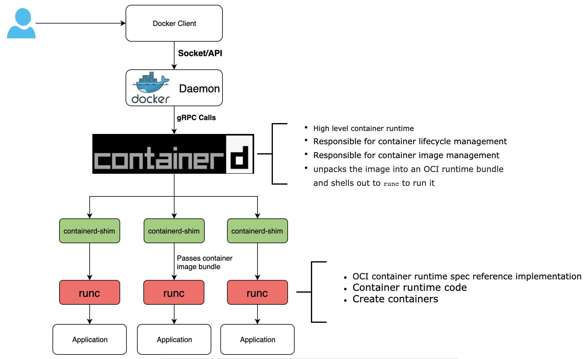

# Architecture de Docker
C'est bien beau de savoir utiliser Docker, mais comment le logiciel Docker est fait concrètement.
C'est la question à laquelle on va essayer d'apporter une réponse.

## 1. Introduction
La documentation de Docker offre une très bonne [introduction à l'architecture Docker](https://docs.docker.com/get-started/overview/#docker-architecture), 
je te laisse analyser cela tranquillement.

C'est bon t'as finis ? Cool

Mais avant de passer au prochain cours,
laisse-moi, cher dev, t'en apprendre davantage sur l'architecture Docker

## 2. La ressource
### 2.1. Vue d'ensemble
Le logiciel Docker est ce que l'on appelle un logiciel `Client-server architecture`,
ce qui veut dire que dans ce logiciel se trouve deux sous-logiciels le `Docker Daemon`
et le `client`. Dans cette architecture le `client` communique avec plusieurs `deamons`lancé par `Docker daemon`.

PS. Avant de continuer, pour être sûre que l'on est tous sur la même longueur d'onde,
voici la différence entre [un daemon, un process et un service](https://help.interfaceware.com/v6/differences-between-processes-daemons-and-services)

Ce qui veut dire qu'en réalité tu utilises le `client` juste pour passer les commandes 
à une API REST. Et c'est cette API REST qui transmettre les infos 
au `docker daemon` qui va ensuite faire tout le boulot à savoir construire les images, lancer les conteneurs, pousser les images, etc.

Juste pour re-situer les informations que tu as vues dans la documentation de Docker le `dockerd` est le Docker Daemon et `docker` est le client.
Et enfin le `docker registries` est l'endroit où les images sont stockés, par défaut `Docker daemon` 
est configuré pour interagir avec DockerHub, 
mais tu peux très bien configurer un `registry` privé. 
Mais passons, c'est juste des termes de l'écosystème Docker dont on se passera pour le moment <emoji>.

### 2.2. Docker "under the hood"
Docker est fait en [Go](https://go.dev/) un langage tres répandu dans l'écosystème des conteneurs, 
ce langage permet à Docker d'être assez modulable. 
Ce qui veut que lors de l'installation de Docker, 
il installe par défaut les composants les plus importants qui sont :
- le `client` 
- `Docker daemon`
- `containerd` : responsable de la gestion du cycle de vie des conteneurs (creation, suppression, etc.)
- et le`runc` : lance les conteneurs selon des spécifications précise décidé par une organisation appelée `Open Container Initiative (OCI)` 

C'est en réalité l'association de ces 4 composants qui permettent la création d'un conteneur.

Voici un schéma pour illustrer tous ça.

## 3. Points importants à retenir
En résumé tu dois garder en tête que Docker est ensemble de composants qui ont chacun un rôle bien précis.
Le front aussi appelé `client` envoie les commandes au back `docker daemon` via une API REST. 
Ensuite `docker daemon` communique à son tour avec `containerd` et `runc` pour créer un conteneur.

## 4. Pour aller plus loin
Ce cours n'est qu'un petit avant gout du monde extraordinaire des conteneurs Docker
et vous aurez j'en suis sûr l'occasion d'en apprendre davantage sur les composants que l'on vient de voir.
Mais si tu souhaites continuer un peu plus sur ce chemin voici 
un [article](https://www.grottedubarbu.fr/container-runtimes-c-est-quoi/) va littéralement t'assoiffer d'en apprendre plus sur Docker. :smiley:
