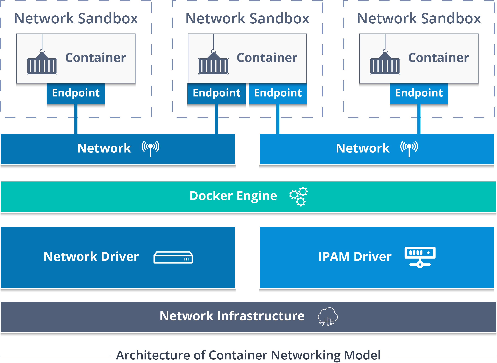

# Docker-compose - Le réseau

## 1. Introduction

Le réseau est plutôt complexe à comprendre de prime abord et c'est normal, Docker à mis des années à le mettre en place et couvrir la plupart des cas d'utilisation
afin que nous, les utilisateurs, puissent adhérer au produit.

Pour ne rien te cacher, il est normal de mettre quelques années avant de comprendre tous les composants et la manière dont marche le réseau Docker.
Mais pas de panique, mon seul but est encore une de te faire découvrir les bases et pour que tu puisses voler de tes propres ailes :smiley:

## 2. La ressource
### 2.1. L'architecture réseau de Docker

L'implémentation du réseau Docker se base sur l'architecture CNM (Container Networking Model). 
Docker considère le `CNM` comme un modèle, une philosophie et non de quelque chose de figé,
car il est possible d'implémenter cette architecture de plusieurs manières différente.

Ici nous allons uniquement nous concentrer sur son fonctionnement global, et pour ça, on va partir d'une representation assez répandue de cette philosophie

Ci-dessus, tu as un schéma qui illustre assez bien le `CNM` et comme tu le vois, il y a beaucoup de choses dessus, essayons donc comprendre chaque élément un par un :

- Sandbox : c'est une **unité de réseau isolé** qui contient tous les composants nécessaire associé à un seul conteneur. 
  En d'autres mots, c'est une representation miniature du des composants réseau qui se trouve sur ta machine.

  Et devines comment Docker arrive à faire ça ? Eh bien en utilisant le namespace réseau de Linux, bien sur ! :smiley:

- Endpoint : **Un `Endpoint` vit dans la `Sandbox` et a pour role de connecter le conteneur au `Network`**.
  
  Sans `Endpoint` la communication entre deux conteneurs serait impossible.

  Autre point, comme on le voit le schéma, ci-dessus, **un conteneur peut avoir plusieurs `endpoint` mais exactement un `Endpoint` pour chaque `Network`**.

- Network : C'est tout simplement une collection de `endpoint` relié entre eux.
- Docker Engine : Tu connais déjà ce composant. :wink: C'est le maître à bord, il contrôle l'interaction de tous les composants que soit le `CNM`, la gestion des conteneurs, etc.
- Network Driver : En charge de gérer l'implémentation globale du `CNM`
- IPAM (IP Address Management) Driver : Permet l'allocation de sous-réseau et des IPs, pour les composants `Endpoint` et `Network` 
- Underlying Network Infrastructure : Fait reference aux différents éléments de ta machine qui permettent la création de tous les autres composants.

Maintenant cette vue d'ensemble attardons-nous un peu sur les different `Network driver` et leur utilité.

### 2.2. Network Driver

Hier on a dit que Docker de manière générale avait une architecture modulaire, ce qui à l'utilisateur de supprimer ou ajouter des composants selon le besoin.

Justement, il se trouve que le composant `Network Driver` de Docker est un example parfait de cette architecture.
Mais passons on s'égare, ce que je veux te faire comprendre ce que bien que très modulaire Docker vient déjà avec déjà pas mal d'éléments et surtout cinq `Networks Driver différents` qui sont :

- Host
- BRidge
- Overlay
- MACVLAN
- None

T'expliquer la spécificité de chaque composant et leur utilité, prendrait un parcours entier et ne serait pas très intéressant pour toi à l'heure actuelle. 
C'est pour cela que tu vas à l'aide cette [video](https://www.youtube.com/watch?v=5grbXvV_DSk&t=697s), avoir un rapide apercu de ces composants, ce qui sera entièrement suffisant pour que tu ais des bases solides.

Maintenant que toutes les connaissances nécessaire place à la pratique. :smile:

### 2.2. Le réseau avec Docker

Je t'invite à suivre et à reproduire les examples que Xavki va te montrer dans cette [video](https://www.youtube.com/watch?v=YcAWluYkVXc).

### 2.3. Le réseau avec Docker-compose

Encore une [video](https://www.youtube.com/watch?v=hxVxmh3MlD8) de Xavki arrive la rescousse pour te montrer comment jouer avec le réseau Docker à travers Docker-compose.
N'hésites pas à reproduire les examples que tu vas voir, ça va grandement t'aider à solidifier les connaissances que tu viens d'acquérir. :smile:

## 3. Points importants à retenir
Voici les points importants à retenir :

- Les concepts derrière le `CNM`
- Le rôle des principaux composants du `CNM`
- Pas besoin de retenir le role de chaque `Network Driver` excepté pour les deux principaux, à savoir le `Bridge Network` utilisé dans 90% des cas en locale 
  et le `Overlay Network` qui sert à lancé Docker sur plusieurs machines en même temps.

## 4. Pour aller plus loin
Tu l'as compris le réseau Docker est très vaste, très complexe et très challengeantes, je ne sais pas toi, mais le tri vaste, complexe et challenges me fait sauter de joie.
Enfin bref ! Pour aller plus loin le meilleur point de départ est la [documentation officielle de Docker sur le réseau](https://docs.docker.com/network/)